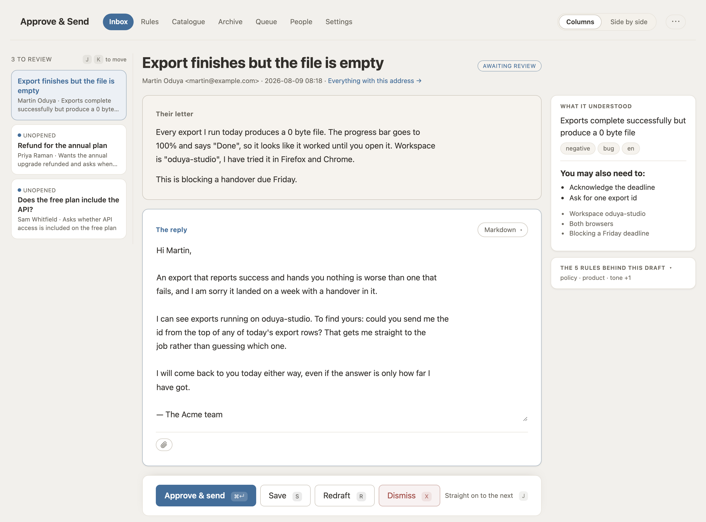

# Approve & Send — the manual

**Everything this thing does, and why it does it that way.**

English · [简体中文](MANUAL.zh-CN.md) · [← back to the README](README.md)

This is the long version: how it works, how to install it, and every setting
worth knowing. If you would rather not read it, you do not have to — hand this
file to an AI assistant and ask it to do the setup for you. The README says how.

Most "AI email assistant" projects stop at the draft. Approve & Send's point is
the loop after it: when you edit a draft before sending, the system compares the
two versions, works out what principle the change implies, and turns that into a
rule the drafter follows next time.



> **Status: v0.1.** Complete end to end — fetch, draft, review, send, learn —
> and running in production nowhere. The private tool it was extracted from has
> handled 929 emails and learned 213 rules; this rewrite has been run by nobody
> but its author.

## Free, and open all the way down

**MIT, all of it.** Not a core with the useful parts held back, not open source
with a hosted tier you get pushed towards, not free until you have five seats.
There is no paid version of this because there is no version of this that isn't
yours: no account to make, no licence key, no usage limit, nothing that calls
home. Clone it, read every line, change what you disagree with, sell it if you
like.

**One bill, and it isn't ours: the model.** Take whichever of these you already
have.

- **An API key.** Anything speaking OpenAI's chat-completions API — OpenAI,
  Anthropic, DeepSeek, Qwen, Moonshot, Zhipu, OpenRouter, Groq, Together, your
  own gateway. A base URL, a key and a model name.
- **A subscription you are already paying for.** Claude Pro/Max or ChatGPT
  Plus are seats in an application rather than credits on a platform, so there
  is no key to paste — Approve & Send spends them through their own `claude` or
  `codex` command line instead. Nothing metered, nothing extra.
- **Neither.** Ollama, LM Studio, vLLM or llama.cpp on your own hardware, in
  which case the running cost is electricity and the mail never leaves the
  building.

Everything else it needs, you have: a mailbox you already own, a SQLite file,
and a machine that stays switched on.

## Why it exists

Support inboxes are where a small team's time goes. Full automation is not
acceptable — a wrong refund answer costs more than the time it saved — but
"human writes every reply from scratch" doesn't scale either. Human-in-the-loop
with a learning curve is the middle path, and it needs to be self-hosted,
because this data is your customer correspondence.

## How it learns

When you edit a draft before sending it, that edit is the lesson. Approve & Send
diffs the two versions, asks a model what principle the change implies, and
writes it down as a rule:

```
draft:  "I'm so sorry. Your refund will arrive within 3 days."
sent:   "We've escalated this and will update you shortly."
learned: "Never commit to a refund date that has not been confirmed."  [policy]
```


**Nothing a model writes reaches a prompt until a person says so.** A learned
rule lands as a *proposal*: stored, visible, deduped against, and inert. It is
waiting at the top of the rulebook with the conversation that produced it, and
Approve is what puts it into drafting. The same gate covers rewrites — when the
learning pass wants to sharpen a rule that is already live, or the weekly tidy
wants to merge two, that arrives as a proposal against the existing rule showing
both wordings, because text a model wrote while reading a stranger's email is
the same escalation whether it starts a rule or edits one.

Rules are inspectable, editable and switch-off-able. Each one records which
conversation taught it, why, and how often it has been used — so when a rule
starts producing bad replies you can find out where it came from instead of
guessing. Near-duplicates are merged rather than accumulated, and every change
to a rule's text keeps the previous version. `/rules` is one line per rule
ordered by how often each has fired, and each has a page of its own to edit on:
the rules nobody has ever used sort to the last screen, which is the screen
worth reading, because a rule that has never fired is either written too
narrowly or ready to retire.

**Rules are routed by topic, not all sent at once.** `topics` in the config
names the kinds of mail this desk gets ("wants money back, disputes a charge, or
is cancelling"), an incoming email is tagged against that list, and a rule
carries the topics it applies to as tick-boxes rather than as a phrase somebody
typed. Ticking nothing means the rule applies to everything, which is a real and
common answer, so there is no "all mail" box to tick.

Approving a draft unchanged usually teaches nothing, and the extractor is told
so. The rulebook is meant to stay small enough to read.

**Throwing a draft away also teaches**, if you say why. Dismissing a task with a
reason in the box learns from your sentence rather than from a diff — the model
is told to take you at your word and is explicitly *not* asked whether the
rejection was fair. Two guards keep this from filling the rulebook with noise: a
vague reason ("wrong tone") is told to propose nothing, and a routing decision
("this one needs a human") is not a rule. Amendments are common here, because a
draft that broke a rule the rulebook already contains means the rule was not
stated firmly enough. Bulk dismiss carries no reason, and so teaches nothing.

Extraction runs in the background — clicking Send never waits on a model — on a
job queue that is one SQLite table, because "self-hosted" should not mean "also
run Redis".

There is a second model in the path too: before any human sees a draft, a critic
reads it against the same rules and either signs it off or rewrites it. It
catches the expensive failure, which is a reply that reads perfectly well and
quietly breaks a policy.

## What reaches you, and what doesn't

Not every message deserves a draft, and a queue that shows you all of them is a
queue you stop reading.

**Bulk mail is filtered by its headers, not by a classifier.** Six checks, in
order: a `List-Unsubscribe` header, an `Auto-Submitted` that isn't `no`, a
`Precedence` of bulk/list/junk, an `X-Auto-Response-Suppress`, an empty
`Return-Path`, and finally a From address like `no-reply@` or `mailer-daemon@`.
No model call, no scoring, nothing to tune — the sender told us in the envelope.

Filtered mail still becomes a task. It arrives dismissed with the reason written
on it, because a desk that suspects the software is eating customer mail should
be able to go and look instead of taking our word for it. What it saves is the
thread fetch and the model calls, which is where the money was.

**A follow-up retires the draft it overtook.** When a second message lands on a
thread that already has an unanswered task, the older one is dismissed and
linked to the newer, with a banner at the top saying so. Sent tasks are never
touched: no later message unsends a mail already sitting in somebody's inbox.
Mail somebody on your team already replied to by hand is skipped on the way in.

**Every draft is graded before you see it.** Not by a model — by arithmetic over
things already known, so it costs nothing and can name its reasons: the critic
refused to sign it off, the customer is angry or unhappy, no rule covered this
one, the thread is four messages deep, or the drafter thinks this is a real bug
on our side. Any of the first two makes it *Needs care*; anything else makes it
*Worth a look*; nothing makes it *Routine* and it wears no badge at all. The
inbox shows only the highest tier, because a queue where every row has a badge
is a queue with no badges.

**A dot means you have not opened it.** Only on drafts waiting for review —
everything pending is unread by definition — and it comes back when the machine
rewrites the draft, because a task that stayed "read" through a rewrite is one
nobody is told to go back to.

## Whether anything is actually running

A queue only ever shows what is left, which by design never looks finished. So
the inbox opens with what has already happened — **sent today, rules learned
today** — and the header carries the same two figures on every other screen.

Beside them is a light for the queue, and it asks whether the worker is *alive*
rather than whether the queue has anything in it. Those two come apart in
exactly the case worth catching: a crontab nobody set up produces a growing
backlog, which is not health. *Running*, *stalled* — work waiting and nothing
moving — or *idle*, which is a quiet desk being correctly quiet.

A desk nobody ever wired up looks identical to a desk with nothing to do, right
up until somebody notices the drafts stopped arriving three days ago. So the app
records when each of its four endpoints was last called, says so on the settings
screen against the cadence it expects, and puts a banner on the inbox when the
answer is *never*. It has no scheduler of its own and deliberately does not grow
one: a timer inside a web process is a timer that stops when the process is
recycled and says nothing about it.

**Search** is a box on the inbox that reads the mail and the analysis, dismissed
ones included. **Theme** is light, dark, or whatever the machine says — three
states, not two, with system the default and still live, so a laptop that goes
dark at sunset takes the desk with it. It is rendered from a cookie on the
server rather than applied by a script, because a theme that arrives after first
paint is a white flash on a dark desk, once per navigation.

## On the review screen

The draft is the middle of the page, in a box that opens at the length of what
is in it. That is not a detail: a fixed-height box showing two thirds of a reply
collects approvals for text nobody read, because a textarea that looks full is
read as full. The exception is a reply quoting the thread it answers, which is
cut where the quote starts.

**The box shows the reply, and the source on the click.** It used to hold
Markdown: `**` around the sentence that matters, `- ` in front of the amounts,
and a reviewer deciding whether the reply is right doing the rendering in their
head. Reading is what this screen is for — writing is the exception that happens
a few times a day — so it shows the rendering by default and the source on the
click that starts an edit. The rendering is the same code that composes the
mail, imported rather than written twice: a second renderer would be a second
answer to "what will they receive", which is the one question this screen exists
to give one answer to. The diff wins where both apply — that is a control
somebody pressed, and the rendering is merely the state the card is in when
nobody is typing in it.

**Your own edits are coloured as you make them.** The same diff the learning
pass runs after the mail has gone, brought forward onto the screen of the person
making the change — who until now had never once seen it. No model, no request:
it is computed during the render and thrown away with it.

Around the draft:

**What it understood** — language, sentiment, what the message is about, and
where the fault lies. That last one is a ladder the drafter is told to walk down
and stop at the first rung that fits: our bug, a limit we know about, easy to
get wrong, something they did, nothing broken. It is for whoever reads the
reply, never for the reply — the customer is never told whose fault it was — and
it exists because a desk that assumes user error is a desk where real bugs go
unreported for weeks.

**Other ways to answer** — every draft arrives with up to three alternative
replies behind it, each with a one-line strategy, sitting in a tab strip above
the draft box. No button to press: they are generated with the draft, on a job
behind it, which costs roughly four model calls per mail instead of one. The
tabs are positional and carry no ranking; picking one moves it into the box and
keeps what was there in the earlier drafts. Picking teaches nothing by itself;
what you then edit and send does.

**Markdown, plain text or HTML** — a tab strip on the draft says which. Markdown
is the default and gets a text part and an HTML part derived from the same
source, so the two cannot say different things; plain text sends exactly the
characters you typed, asterisks and all; HTML hands the markup through. The tabs
are buttons on the same form as the draft, so switching one carries your current
edits rather than the last saved version.

**The queue stays on the screen.** In columns mode a rail down the left holds
what is waiting, so finishing one reply means clicking the next instead of
navigating back to the inbox forty times a day. The keyboard does the same
without the mouse: `⌘↵` sends, `S` saves, `R` redrafts, `X` dismisses, `J` and
`K` walk the queue. Every one of those presses a button or follows a link that
is already on the page — with JavaScript off the desk is identical in what it
can do and in what it will send.

**Two layouts, one screen.** Columns is "there are forty of these today and I am
going through them"; side by side puts their letter and your reply at equal
width for the one that is hard to call. The switch is in the header and it
remembers, per reader — it is a cookie, not a column on a row, so two colleagues
sharing a password do not flip each other's screen.

**A screen waiting on a job refreshes itself.** Ask for a redraft and the panel
polls until the new reply lands, and each poll turns the queue over once on your
behalf, so a chained job moves now rather than at the next cron tick. Nothing
polls an idle screen.

**The history** — nine things get recorded against a task: received, drafted,
edited, redraft, dismissed, reopened, sent, failed, superseded. Who did it, when,
and what they said. Recording is best-effort and never fails the thing it is
recording; a history that can break a send is worse than no history.

**Everything from this address** — `/senders/someone@example.com`, one
correspondent's whole file, chronological, every status. The context card already
tells the model "we have replied to them 3 times before"; this is for the
reviewer who has read that and now needs to know *what we said*, which is usually
the moment before they catch a reply about to contradict one.

**The letter as it was written.** A mail with an HTML part is rendered as one:
its tables, its lists, its bold, and its links with the addresses still on them.
Before this the desk stored only a flattened transcript — the same one the model
reads — so an invoice arrived as a column of loose words and "click here" arrived
with nowhere to click. The markup is rebuilt from an allowlist before it reaches
the page: known tags, known attributes, known style properties, and nothing that
could take an element out of its place in the flow. Plain-text mail, and anything
whose HTML is bigger than half a megabyte, reads exactly as it always did.

A long letter is capped so the reply stays on screen beside it, with a button
under it that opens the rest — and no button at all on the letters that already
fit, because a control that does nothing is a control in the way.

**Remote images load, but the desk fetches them.** A picture pulled straight
from a stranger's server is a read receipt: it tells them the address is live,
that a person opened the mail, when, from which IP and in which browser. So the
server retrieves it once and serves it to you from your own origin — what the
sender learns is that something fetched an image, with no referrer and no
fingerprint, which is the version every serious mail client has shipped for a
decade. `MAIL_REMOTE_IMAGES=false` turns it off; then nothing is fetched and the
letter says how many pictures it asked for.

The proxy only fetches addresses that came out of a letter this desk rendered —
they are signed — and it refuses private ones. ``
in an email is a request that the desk read its own cloud credentials aloud, and
the name is resolved before the check so that `internal.example.com` cannot point
at 10.0.0.1 and be believed.

**Screenshots, shown.** "Here is what I'm seeing" is a whole genre of support
email and it arrives as an inline image. Those are not remote — they come
attached to the mail, in your own mailbox — so they render where the sender put
them in the letter, as well as in the row of thumbnails under it. PNG, JPEG, GIF
and WebP, the formats that decode to pixels and nothing else. Everything else,
SVG very much included, stays a download: an SVG is a document that can carry
script, and displaying one a stranger sent inside your own origin hands them the
reviewer's session.

**A file picker**, in the same form as the draft and the Send button, so what
goes out is what is on screen. Nothing is stored on our side — the Sent folder is
already keeping the copy — but the filenames go on the task's history, because
"why does this customer have our invoice" is a question about the desk and only
the audit trail can answer it. 15 MB per reply, checked before the send.

## Starting from your Sent folder

A fresh install knows nothing, which means the first few weeks are the ones
where it is least useful. Your Sent folder already contains the answers, so
there is a screen — **Archive**, at `/backfill` — that reads them.

It cannot learn the way the review loop does, because an archived reply has no
draft to diff against. So it makes one: for each old reply it drafts what the
assistant *would* write today, compares that against what you actually sent, and
keeps only what the difference teaches. Where the current rulebook already gets
it right the two agree and nothing is learned, which means the run gets cheaper
and quieter as it goes.

```bash
# Archive → look back 12 months, at most 200 replies → Scan
```

Nothing is sent, nothing is written to your mailbox, and every rule it produces
appears in the rulebook with the conversation behind it, to keep or retire like
any other. It is a background job at the lowest priority, so it never delays
today's mail; budget two or three model calls per archived email. Stop halts what
has not started; work already in flight finishes.

## Moving in from something else

If you are replacing a desk you already had, `/api/import/legacy` reads its
SQLite file directly — answered conversations become tasks marked sent, with
their threads, and its rulebook comes across matched on rule text rather than on
ids, so running it twice imports nothing twice:

```bash
# In the environment, for the duration of the import and no longer:
#   AAS_IMPORT_ROOT=/srv/old/data
curl -H "Authorization: Bearer $CRON_TOKEN" -XPOST localhost:3000/api/import/legacy \
  -d '{"path":"/srv/old/data/tasks.db","messagePrefix":"4243...0002"}'
```

The endpoint answers 403 until `AAS_IMPORT_ROOT` names a directory, and refuses
any path that resolves outside it. Without that, a body field would be a request
to open an arbitrary file on the host as SQLite; take it back out once the
import has run.

Two details that matter. The old reply is stored as the draft **only if** its
history shows nobody edited it — otherwise the learning loop would read a human's
rewrite as a machine draft nobody changed, and learn the opposite of the lesson.
And `messagePrefix` is what lets the importer reconstruct provider message ids;
without it the import still works, the response warns you, and your next sync
will re-ingest all that answered mail as new tasks.

A database snapshot is taken before the first write. The same mechanism guards
the weekly rules tidy, which keeps the last five.

## Writing mail nobody asked for

**Compose** — `/compose` — takes an address, an optional subject and a brief in
whatever words you have ("tell them the migration is done, apologise for the
week it took"), and drafts from it using the same rulebook, the same persona and
the same context lookups as a reply. It lands as an ordinary task at the review
screen.

There is no Send button on the compose page. Drafting and approving are separate
acts here, and a screen that could do both would make outbound mail the one thing
in this product that goes out without a second look.

The critic does not run on composed mail and the attention grade does not apply:
there is no customer sentiment to read and no thread to be long. A subject you
typed is never overruled; one you left blank is filled in by the model.

## What it doesn't do

Being clear about this early saves you an evening:

- **One mailbox.** Named operators can sign in separately and the history says
  who sent what, but there is one inbox and one rulebook, and the rulebook
  learns from everybody at once.
- **No routing, assignment, tagging or SLAs.** It is not a helpdesk and won't
  become one. If you need queues per agent, use a helpdesk.
- **No bulk send.** Dismiss, reopen and delete act on a selection; approving
  never will. A hundred replies approved without reading them is not a feature,
  it is the failure this product exists to prevent.
- **No mobile app.** The UI is plain server-rendered forms. They work on a
  phone; they are not designed for one.

## Running it

```bash
npm install
npm run build && npm start      # http://localhost:3000
```


A fresh install opens the setup wizard: **lock the door, pick a model, connect
the mailbox, say who you are.** Only the model is required. Each step ends by
using what you typed — one completion against the model, one login to the
mailbox — and tells you what came back, so a wrong port or a stale key surfaces
there rather than in a failed job at 4am.

It writes `.env` and `aas.config.json`, the same two files you would edit by
hand, and only the keys it asked about; your comments and everything else stay
put. Values take effect immediately — no restart. On a read-only container the
write fails and the page hands you the lines to paste instead. Completion is
read back out of the config rather than from a "you finished the wizard" flag,
so a wizard you skipped and a wizard you did by hand look the same.

Once the wizard is done, the same address stops being a wizard. `/setup` becomes
**Settings**: a directory down the left and one subject at a time on the right,
each opening with what it is *set to* — "Drafting with gpt-5.6-luna" — rather
than with a paragraph explaining what a model is.
The step pages forward into it, so a model is changed in one place whichever
bookmark got you there. Nobody who came back a month later to change a model
name should have to walk past "Step 1 of 4: lock the door" to reach it.

Lock the door before you expose the port: either set `ADMIN_PASSWORD` to a shared
password, or create named operators, whose replies then carry their names. Either
one raises the login wall. With neither, there is no wall and every page says so
in red.

**Operators are admins or reviewers.** The queue, the archive, the people list
and the settings are for admins; a reviewer gets the mail and nothing else, and
the nav does not offer them links they cannot use. Typing the address lands them
on the inbox rather than on a refusal — there is nothing they can do about being
told no, since the fix is a colleague pressing a button on a screen they cannot
see. The shared `ADMIN_PASSWORD` is the key to the whole install and so counts
as an admin; on a desk with no password there are no roles to enforce.

Nothing to review yet? The empty inbox has a **Load sample data** button: five
fictional emails and a rulebook, including one reply that was edited before
sending and the two rules that edit taught. It refuses to touch a database that
already has anything in it.

Four endpoints drive it from cron:

```cron
*/5 * * * * curl -sX POST -H "Authorization: Bearer $CRON_TOKEN" localhost:3000/api/sync
*/2 * * * * curl -sX POST -H "Authorization: Bearer $CRON_TOKEN" localhost:3000/api/worker
17  * * * * curl -sX POST -H "Authorization: Bearer $CRON_TOKEN" localhost:3000/api/sweep
30 4 * * 1  curl -sX POST -H "Authorization: Bearer $CRON_TOKEN" localhost:3000/api/consolidate
```

`/api/sync` pulls the inbox into tasks, `/api/worker` drains a batch of jobs,
and `/api/consolidate` is the weekly tidy — it merges rules that have drifted
into saying the same thing. `/api/sweep` is the one you will forget you have:
it finds emails whose drafting job died without saying so, which otherwise sit
in the database looking like nothing at all. Twenty minutes of silence counts as
died; it either requeues the task or marks it failed with the error the job left
behind. All four have buttons in the UI too, so you can run without a scheduler
while you are trying it out.

There is also `/api/health`, which is unauthenticated on purpose so an
orchestrator can use it, and answers 503 when the database does not.

The **Queue** screen is the one to open when something has not happened, so it
opens by answering that rather than with five counts: one sentence naming what
went wrong and a link to where it is fixed. `AI_MODEL is required` is not fixed
by pressing Retry, and Retry was the only button on the screen — an error whose
only offered action cannot work teaches the operator that the action does not
work, not where the fix lives. So a missing model says so and points at
settings, a rejected key says the key was rejected, an unreachable mailbox
points at the mailbox, and a timed-out generation says retrying is worth a try.

Below that it lists the last fifty jobs with their attempts and their errors,
and gives each row the one control its state deserves: retry a failed job,
unstick one that has been processing since a crash, delete one that should never
have been queued. Deleting asks for no confirmation — the job is a note to do
something, not the something.

The whole UI is plain forms — it works with JavaScript off, and a half-written
draft survives a reload because it was posted rather than kept in component
state. That includes acting on several tasks at once: the checkboxes and the
bulk bar are one `<form>`, with no client-side JavaScript anywhere in them.

Reopening is the way back from any status except sent. If a draft is still there
you get it back with no model call; if not, it is queued for a fresh one. Sent is
the one door that does not open again, everywhere in the product.

## Bring your own model

One `AI_MODEL` line is the whole setup for the simple case:

```bash
AI_PROVIDER=openai-compatible
AI_BASE_URL=http://localhost:11434/v1   # Ollama, LM Studio, vLLM, llama.cpp…
AI_API_KEY=                             # empty is fine locally
AI_MODEL=qwen2.5:14b
```

Anything speaking the OpenAI chat-completions API works — OpenAI, OpenRouter,
Groq, DeepSeek, Qwen, Moonshot, Zhipu, SiliconFlow, Together, your own gateway.
`AI_PROVIDER=anthropic` speaks `/v1/messages` natively.

The settings screen offers those **by name** and writes both lines for you. The
menu used to ask which *dialect* your endpoint speaks, which is a question about
wire formats asked of somebody who wants to use the DeepSeek key they already
have — and who then had to go and find `https://api.deepseek.com/v1` to paste
into the box underneath. Pick the service and the address is filled in, with a
current model name suggested in an editable field. Nothing in `.env` changed
shape: the menu reads itself back off `AI_PROVIDER` and `AI_BASE_URL`, so a file
written by hand still opens on the right line.

**Or spend a subscription instead of a key.** Claude Pro/Max and ChatGPT Plus
have no endpoint to point `AI_BASE_URL` at, but both ship a command-line agent
that authenticates against the seat, and this runs it as a subprocess:

```bash
AI_PROVIDER=cli
AI_CLI=claude        # or codex, for ChatGPT Plus/Pro
AI_MODEL=opus        # an alias for the latest of a family, or a full model id
```

Log in once with `claude auth login` or `codex login` and there is nothing to
pay per email. The setup screen finds either binary on its own and offers a
button. What it costs instead: the per-role temperatures below stop applying,
every call re-sends the agent's own preamble ahead of ours, and running out is
a rolling window rather than a bill — so a refusal is never retried. Both are
agents that can read files and run commands, and drafting hands them mail from
strangers, so they are run with their tools denied, in an empty directory, with
none of this server's environment. Both subscriptions are individual seats:
answering your own mail with one is what it is for, and pointing a team's shared
inbox at one is a billing question rather than a technical one.

Four roles (`drafter`, `critic`, `translator`, `utility`) each fall back to
`AI_MODEL` but can point somewhere else. Putting the drafter on a strong model
and the utility work on a cheap one is where most of the cost saving is:

```bash
AI_MODEL=gpt-5.6-luna
AI_MODEL_DRAFTER=claude-sonnet-5
```

See [`.env.example`](.env.example) for every variable the code actually reads.

## Bring your own mailbox

IMAP and SMTP, so any mailbox works — Gmail, Zoho, Fastmail, your own Dovecot:

```bash
MAIL_USER=support@yourcompany.com
MAIL_PASSWORD=an-app-password
IMAP_HOST=imap.yourcompany.com
SMTP_HOST=smtp.yourcompany.com
```

Ports default to 993/465 with implicit TLS, and setting `SMTP_PORT=587`
switches to STARTTLS on its own.

Here too the settings screen has a menu of services by name, and picking one
fills in all four host-and-port facts. They are the same four for every Gmail on
earth, they are written down in a help centre article, and getting one wrong
fails as "could not connect" — which is indistinguishable from a bad password,
and costs an afternoon to tell apart.

Gmail, Google Workspace and Zoho can go through their own APIs instead
(`MAIL_PROVIDER=gmail` or `zoho`), which gets you real threads and no app
password — worth it for Zoho in particular, where IMAP is off until an admin
turns it on. Zoho's is on the same menu, under **Zoho Mail API**: picking it
swaps the host and password boxes for the data centre and the OAuth client it
actually needs. Google's service-account route ends in an admin console with a
private key and is set by hand. See [docs/mailboxes.md](docs/mailboxes.md).

## Tell it who it is

Copy `aas.config.example.json` to `aas.config.json`. This is the whole persona —
no prompt files to edit:

```json
{
  "organization": "Acme",
  "voice": "Warm, direct and specific. No filler apologies.",
  "facts": ["Refunds are processed within 5-10 business days."],
  "topics": [
    { "slug": "refund-and-cancellation",
      "description": "Wants money back, disputes a charge, or is cancelling." }
  ],
  "neverPromise": ["refund dates that have not been confirmed"],
  "signature": "— The Acme team",
  "replyLanguage": "match"
}
```

`facts` are the things the model would otherwise invent. Keep the list short and
load-bearing — it goes into every draft. `replyLanguage: "match"` answers in
whatever language the customer wrote in.

`topics` are the kinds of mail this desk gets, and the `description` is all the
classifier is given — so "asks for money back, disputes a charge, wants to
cancel" beats "billing issues". Incoming mail is tagged against this list and
rules are routed by it. The slug is a machine name and has to stay one forever,
since a rule and a task tagged `refund-and-cancellation` have to be the same
string; an optional `label` is what a reviewer sees instead, and it lives here
rather than in the interface translations because this list is one deployment's
own vocabulary, not the product's.

## Approving mail you can't read

Add `"reviewLanguage": "Chinese"` and every message and every draft is also
rendered into *your* language beside the original — never sent to anyone. The
whole claim of this product is that a person read it before it went out, and a
reviewer approving a Japanese reply they cannot read has not read it.

A translation is tied to a SHA-256 of the exact text it was made from, so a
redrafted reply shows **no** translation rather than the previous draft's — the
one failure a reviewer in this position could never catch themselves. Empty is
the default and turns the mail half off: no job, no model call, nothing on
screen. [docs/review-language.md](docs/review-language.md).

**"Already in your language" is an answer, and it is written down.** A desk
answering Chinese mail in Chinese, to reviewers who read Chinese, used to carry
a line under every reply: *no current translation — run the queue to render this
draft*. Running the queue did not help. The model was asked, it said the reply
was already in the target language, and nothing was stored for that — so the
screen still could not tell "nothing needed" from "not done yet", and the next
edit asked again, forever, on a desk where the answer could never change. Three
states now, where there were two: a row with content is a rendering, no row is a
question nobody has asked, and an empty row is that question answered with
nothing to do. Only the first renders a translation, and only the second shows
the note. A translator that threw has said nothing and is asked again — which is
the whole difference between a service that is down and a reply that needs no
work.

The context cards above the draft are rendered too, and into the *interface*
language rather than this one — a card is furniture on that screen, not mail, so
a desk that reads its own post still gets its lookups in its own words. What the
model was told stays in the words the source wrote it in. Changing the interface
language re-renders them; a desk that has never picked one gets its cards as
their sources wrote them, because a job has no browser to ask.

## Three languages, and they are all different

`"language": "zh-CN"` translates the interface — the buttons, the labels, the
setup wizard. English, 简体中文, 日本語, Español, Français and Deutsch ship;
pick one on the last setup screen or set `AAS_LANGUAGE`.

That is the third language here, and none of the three implies the others. A
team in Tokyo can run the UI in Japanese, read drafts in Japanese, and still
answer a German customer in German:

```
language        zh-CN     what the buttons say
reviewLanguage  Japanese  what the reviewer reads beside each email
replyLanguage   match     what the customer gets
```

There is no i18n framework and no `Accept-Language` sniffing. A support desk is
a room of people who share a language, and a UI that reshapes per laptop makes
"the second field on the mailbox screen" impossible to say out loud to a
colleague. Adding a language is one file in `src/lib/i18n/`, and TypeScript
refuses to build if it misses a key.

## Tell it who it's writing to

"Have you tried logging out?" to someone whose subscription lapsed yesterday is
worse than no reply at all, and the model cannot know that from the email. A
**context source** is a read-only lookup that turns the sender's address into a
few facts — a card above the draft, and a sentence in the prompt.

Stripe is built in. Set `STRIPE_API_KEY` to a restricted read key and drafts
start knowing who is paying you:

```
No active subscription — the most recent one is canceled, last period ended
2026-01-14. Do not talk to them as a current subscriber.
```

The card links through to `/billing/someone@example.com`, which lists every
charge: what was taken, what came back, and what is left. That page exists
because the card is a summary and the question that follows a billing summary is
never the total — it is *which* payment and how much of it has already been
refunded. Answering that from a total is how a desk refunds the same charge
twice. A half-refunded charge is called partially refunded on the page and in the
prompt, because Stripe's own `refunded` flag only turns true on a full refund,
and reading it alone is how somebody gets told "we have not refunded you" while
holding half a refund. Nothing on that page can move money; the link to Stripe's
own dashboard is right at the top.

Four of those facts — who they are, since when, what they are on, and what has
actually stayed with us after refunds — are now on the two screens that decide:
the review screen, and the sender's own page. They used to live only at
`/billing/<address>`, behind a link inside a sentence, far enough that nobody
follows it while deciding whether to promise a refund, and the whole cost of not
following it lands in the reply. The number that is shown is what was kept and
not what was charged, because the gross is what talks a desk into treating
somebody as a large customer it has already refunded in full.

It is read at render time rather than through `contextSources`. A context source
runs in the enrichment job, so it answers for tasks the queue has been through
and says nothing at all on a sender page, which has no task and no job — and it
has to be switched on, where the default is nothing. Where both are on, the
review screen shows the source's card and not this one: the model was given that
one, and a reviewer checking whether a reply is right needs to see what it was
written from. The lookup sits behind a `Suspense` boundary, because it is three
HTTPS calls to a third party with an eight-second timeout on screens whose own
render is a read of a local file; awaited inline, a Stripe outage would be a
review screen that takes eight seconds to appear. A desk with no key renders no
card and no placeholder.

**An address with no billing record is said out loud**, rather than left out. A
card that simply does not appear is indistinguishable from a lookup that never
ran, and that reading is how somebody promises a refund on an account that does
not exist.

**Earlier conversations** are built in too, and need nothing at all: how many
times you have written to this person, when, what about, and whether your
drafts for them usually get rewritten before they go.

Anything else is config, not code — a URL or a command, plus which fields
matter and what they mean:

```json
{
  "contextSources": [
    {
      "id": "product",
      "url": "https://admin.example.com/api/support/lookup?email={email}",
      "headers": { "Authorization": "Bearer ${PRODUCT_TOKEN}" },
      "title": "Product account",
      "fields": [{ "label": "Plan", "path": "level", "map": { "0": "Free", "2": "Unlimited" } }],
      "prompt": ["They have {credits} credits left, expiring {expiry}."]
    }
  ]
}
```

A sentence whose facts are missing is dropped whole rather than rendered with a
hole in it, which is why that format needs no conditionals. When the mapping
isn't enough, a source can still be an ESM module you point at by path.

A lookup too slow to hold a job open — a scrape behind a login, a report that
takes four minutes, a colleague answering in Slack — can post its answer back
instead, and the card appears the next time the screen is loaded:

```bash
curl -H "Authorization: Bearer $CRON_TOKEN" -XPOST localhost:3000/api/tasks/$id/context \
  -d '{"sourceId":"crm","label":"CRM","title":"Account","prompt":"On the annual plan since 2024."}'
```

What that endpoint will not accept is a draft. Its predecessor had one that let
an outside process write the reply text directly, straight past the version
history and the audit trail. A machine token is for adding facts; deciding what
to say with them stays where it can be traced.

Two rules hold everywhere: a source **cannot act** — there is no `refund()` and
there will not be one — and a source writes its **own prose** rather than
handing back a blob for the prompt to `JSON.stringify`. A source that breaks
never stops the mail; drafting is queued even when every lookup failed. Full
interface and worked example in
[docs/context-sources.md](docs/context-sources.md).

## Telling it what you sell

A model asked "how much is the Pro plan" with nothing in its prompt does not say
it does not know. It writes a plausible number, in a confident sentence, to
somebody who will quote it back during a chargeback.

**Products and services** — `/catalog` — is the list that stops that sentence
being written. Pull it from Stripe and each product arrives with its price
already rendered the way a reply should say it ("19.00 USD/month"), because the
thing being stored is a sentence rather than a record, and a model reading raw
JSON has to guess whether `1299` is dollars or cents. Anything Stripe does not
sell, you write by hand. Each entry takes a note — who it suits, what it does
not include, the caveat that keeps the reply honest — and no sync overwrites
your notes.

The list that goes into the prompt is *closed*, and that is the load-bearing
part: a prompt listing three products invites a model to treat them as examples
and improvise a fourth for the customer asking about something else. Withdrawn
entries stay on the list marked "no longer sold; do not offer it to anyone",
said before the description rather than after, because a model that reads the
price first and the withdrawal second has already started composing the wrong
reply. A switch per entry keeps one out of drafts, and the page shows the block
exactly as the drafter receives it — so a wrong switch is found there rather
than in a customer's inbox.

## Deploying

```bash
cp .env.example .env
cp aas.config.example.json aas.config.json
docker compose up -d --build
```

That is the whole thing: the app on `127.0.0.1:3000`, and a second container
that pokes the endpoints on schedule so you do not need cron. The database
is `./data/aas.db` on the host — back up that directory and you have backed up
everything.

Approve & Send needs two things from a host: **a writable disk** and **a process
that stays running**. A $5 VPS has both; so do Fly with a volume, Railway,
Render, Coolify, or the spare machine under your desk. Vercel has neither, and
Postgres would not fix it — the long version is in
[docs/deploying.md](docs/deploying.md), along with the reverse-proxy note you
should read before this is reachable from anywhere but localhost.

## Design notes worth knowing

Three things in here were learned the expensive way:

- **`node:http`, not `fetch()`.** undici enforces a 300s `headersTimeout` that
  `AbortSignal` cannot extend. A local model taking six minutes surfaces as a
  bare `fetch failed` with no explanation. `src/lib/ai/http.ts` sidesteps it.
- **Thread trimming is not an optimisation.** One real 1.4 MB thread failed
  *every* generation at 60-80s. Stripping HTML and keeping the newest four
  messages took that prompt from 1237 KB to 26 KB and it succeeded in 30s.
  `src/lib/thread-context.ts`.
- **Repair the JSON, don't retry the call.** Models fence their output and
  forget to escape quotes inside strings. A three-minute regeneration to fix a
  missing backslash is a bad trade. `src/lib/json-repair.ts`.

## Development

```bash
npm install
npm run typecheck
npm test
```

The AI tests run against a real local HTTP server rather than a mocked client,
so wire format, headers, retry behaviour and timeouts are actually exercised.

## License

MIT — the whole repository, with nothing held back and no second licence for
the parts that matter. Use it, change it, ship it, sell it, run it for a client
and charge them. The only thing asked in return is that the copyright notice
travels with the copy.
