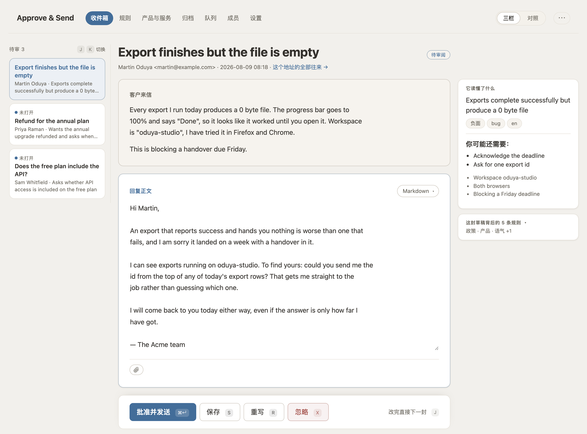
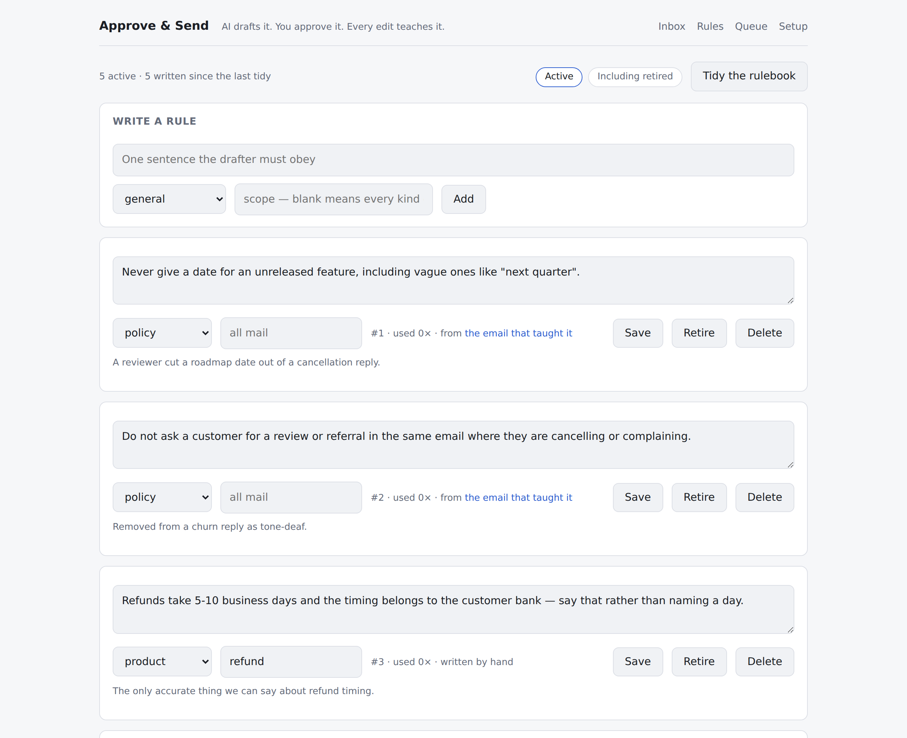
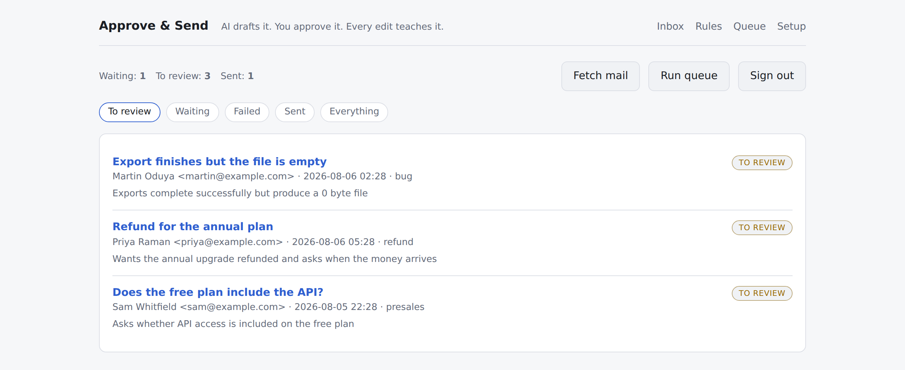

# Approve & Send 使用手册

**它能做的每一件事，以及为什么要那样做。**

[English](MANUAL.md) · 简体中文 · [← 回到 README](README.zh-CN.md)

这是详细版：它怎么运作、怎么装起来，以及每一项值得知道的配置。你也可以不读——把这个
文件交给一个 AI 助手，让它替你把配置做完。具体怎么做，README 里写了。

大多数「AI 邮件助手」到草稿为止就结束了。Approve & Send 的重点是草稿之后的那一圈：
当你在发送前改动一份草稿，系统会比对前后两个版本，推断这次改动背后是什么原则，
再把它变成一条规则，下次起草时照着办。



> **状态：v0.1。** 从收信、起草、审阅、发送到学习，整条链路是完整的，但还没有跑在
> 任何一个生产环境里。它脱胎于一个私人工具，那个工具处理过 929 封邮件、学到 213 条
> 规则；而这份重写版，除了作者本人没有人用过。

## 完全开源，而且免费

**MIT，全部。** 不是留一手的开源核心，不是把你往托管版本上推的开源，也不是「五个人
以内免费」。这里没有付费版，因为不存在哪一份不属于你：不用注册账号，没有许可证密钥，
没有用量上限，代码里没有任何一处回传数据。克隆它、把每一行都读一遍、改掉你不认同的
地方，想拿去卖也可以。

**唯一要花钱的是模型，而这笔钱不进我们口袋。** 下面三条，你手上有哪条就用哪条。

- **一个 API key。** 任何说 OpenAI chat-completions 协议的服务都行——OpenAI、
  Anthropic、DeepSeek、通义千问、Moonshot、智谱、OpenRouter、Groq、Together，
  或者你自己的网关。一个 base URL、一个 key、一个模型名。
- **你已经在付的订阅。** Claude Pro/Max 和 ChatGPT Plus 是应用里的席位，不是平台上的
  额度，所以没有 key 可填——Approve & Send 改成通过它们自己的 `claude` 或 `codex`
  命令行来花这份订阅。不按量计费，也不用额外掏钱。
- **两样都没有。** 用你自己机器上的 Ollama、LM Studio、vLLM 或 llama.cpp，这时候的
  运行成本就是电费，而且邮件一步也没离开过你的机房。

除此之外它需要的东西你都已经有了：一个你自己的邮箱、一个 SQLite 文件，
以及一台一直开着的机器。

## 为什么会有这个东西

小团队的时间都花在客服邮箱上。全自动是不能接受的——一句写错的退款答复，赔进去的比
省下来的时间贵得多——但「每封信都由人从零写起」同样撑不住。人在环里、并且会越用越
熟的方式是中间那条路，而且它必须能自托管，因为这些数据是你的客户往来信件。

## 它是怎么学的

你在发送前对草稿做的那次修改，就是这堂课。Approve & Send 比对两个版本，问模型这次
改动意味着什么原则，然后把它写成一条规则：

```
草稿:  “非常抱歉。您的退款将在 3 天内到账。”
发出:  “我们已经把这件事升级处理，有进展会尽快同步给您。”
学到:  “绝不承诺尚未确认的退款到账时间。”  [政策]
```



**模型写的东西，在有人点头之前进不了任何一次提示词。** 学到的规则以**待批准**的形态
落地：存下来、看得见、参与去重，但不起作用。它带着产生它的那次对话等在规则库顶部，
点「批准」才会进入起草。改写走的是同一道闸门——学习环节想把一条已经生效的规则写得更
硬，或者每周整理想合并两条，都会以「针对某条现有规则的待批准改写」的形式出现，同时
显示新旧两种措辞。因为模型读着陌生人的来信写出来的文字，无论是新起一条规则还是改动
一条，都是同一种权限升级。

规则可以查看、可以修改、可以随时停用。每条规则都记着是哪次对话教出来的、为什么，
以及被用过多少次——这样当某条规则开始产出糟糕的回复时，你能查到它的出处，而不是靠猜。
意思相近的规则会被合并，而不是越堆越多；每一次改动规则的措辞，上一版都留着。
`/rules` 是一行一条、按命中次数排序的列表，每条规则有自己的编辑页；从没被用过的规则
会排到最后一屏，而那恰恰是值得认真读的一屏——一条从没命中过的规则，要么写得太窄，
要么已经可以退休了。

**规则按主题分发，不是一股脑全塞进去。** 配置里的 `topics` 给这张桌子会收到的邮件种类
起名（「想要退款、对某笔扣款有异议，或者要取消」），进来的邮件按这份清单打标签，而
规则用勾选框带上它适用的主题，而不是由谁手打一个词。一个都不勾表示这条规则对所有邮件
都适用——这是个真实且常见的答案，所以没有「全部邮件」这个选项可勾。

原样批准一份草稿通常什么也教不到，提取器也被明确这么告知过。规则库要小到还有人愿意
从头读一遍。

**把草稿扔掉同样会教到东西**，前提是你说明理由。带着理由忽略一条任务，学到的是你写的
那句话而不是一次 diff——提示词要求模型照你说的理解，并且明确**不**去评判这次拒绝是否
合理。两道闸门挡住噪音：理由太空泛（「语气不对」）会被要求什么都不提；属于流转决定的
（「这封得找个人来处理」）不算规则。这里出现规则改写的情况很常见，因为一份草稿违反了
规则库里已有的规则，说明那条规则写得还不够硬。批量忽略不带理由，因此什么也教不到。

提取在后台跑——点发送永远不会等模型——跑在一个只有一张 SQLite 表的任务队列上，因为
「自托管」不该顺带意味着「还得再跑一个 Redis」。

这条链路上还有第二个模型：在任何人看到草稿之前，一个复核角色会拿同一批规则读一遍，
要么放行，要么重写。它拦的是那种代价最高的失误——读起来完全通顺、却悄悄违反了政策的
回复。

## 什么会送到你面前，什么不会

不是每封邮件都值得起草一份回复，而一个把所有邮件都摆给你看的列表，是一个你迟早不再
看的列表。

**群发邮件靠信头拦，不靠分类器。** 六项检查，依次进行：`List-Unsubscribe` 信头、
不为 `no` 的 `Auto-Submitted`、取值 bulk/list/junk 的 `Precedence`、
`X-Auto-Response-Suppress`、空的 `Return-Path`，最后是形如 `no-reply@` 或
`mailer-daemon@` 的发件地址。不调模型、不打分、没有参数可调——发件方在信封上已经
告诉我们了。

被拦下的邮件仍然会生成一条任务。它一进来就是已忽略状态，理由写在上面，因为一张怀疑
软件正在吞掉客户邮件的桌子，应该能自己去翻，而不是听我们的一面之词。省下来的是抓取
整条会话和那几次模型调用，也就是花钱的地方。

**后来的邮件会让它追上的那份草稿退场。** 当同一条会话上落下第二封邮件、而前一封还挂着
没回，旧的那条会被忽略并链到新的那条，页面顶部有一条横幅说明。已发送的任务永远不动：
不会有哪封后来的邮件，去撤回一封已经躺在别人收件箱里的信。你的同事已经手动回过的邮件，
在进来的路上就被跳过。

**每份草稿在你看到之前都已经评过级。** 不是用模型——是拿已经知道的东西做算术，所以
不花钱，而且能说出理由：复核意见不同意直接发出、客户很生气或不满意、没有规则覆盖这种
情况、这轮对话已经来回了四封、或者起草时认为这确实是我们这边的 bug。前两项中的任何
一项就是**需谨慎**；其余任何一项是**留意一下**；一项都没有就是**常规**，什么标记都不带。
收件箱只显示最高的那一级，因为一个每行都有标记的列表等于没有标记。

**一个圆点表示你还没打开过它。** 只出现在等待审阅的草稿上——待处理的按定义就都是未读
——并且在系统重写草稿后会重新亮起，因为一条在重写之后仍然保持「已读」的任务，是没有
人被提醒回头再看一眼的任务。

## 有没有东西真的在跑

队列永远只显示还剩什么，按设计它就不可能看起来像「做完了」。所以收件箱开头先说已经
发生的事——**今天发出多少封、今天学到多少条规则**——其他每个页面的顶栏也带着同样这
两个数字。

旁边是队列的状态灯，它问的是工人**还活着吗**，而不是队列里有没有东西。这两个问题恰恰
在最该抓住的那种情况下会分岔：一份从没配好的 crontab 产生的正是越积越多的待办，而积压
不等于健康。三种状态：*运行中*、*卡住了*（有活等着但久久没动静）、*空闲*——空闲是一张
安静得很正确的桌子。

一张没人接上调度的桌子，和一张没事可做的桌子，看起来一模一样，直到有人发现草稿已经
三天没来了。所以应用会记下四个接口各自最后一次被调用的时间，在设置页面上对着它期望的
频率说出来，并在答案是「从来没有」时在收件箱顶部挂一条横幅。它自己没有调度器，而且
刻意不去长出一个：跑在 web 进程里的定时器，会在进程被回收时一起停掉，而且什么都不说。

**搜索**是收件箱上的一个框，连正文带分析一起搜，已忽略的也翻。**主题**是浅色、深色，
或者跟着这台机器走——三个状态而不是两个，默认跟随系统而且一直跟着，所以一台在日落时
转深色的笔记本会把这张桌子一起带过去。它由服务端从 cookie 渲染，而不是靠脚本事后套上，
因为一个在首屏之后才到达的主题，在深色的桌子上就是一次白闪，每导航一次闪一回。

## 审阅页面上有什么

草稿在页面正中，而这个框会按里面内容的长度展开。这不是细节：一个固定高度、只露出回复
三分之二的框，收集到的是对没人读过的文字的批准——一个看起来是满的文本框，读起来就是
满的。例外是引用了原始会话的回复，那种会在引文开始的地方截断。

**你自己的修改会一边改一边被标出颜色。** 就是学习环节在邮件发出之后跑的那个 diff，
被提前搬到做这次修改的人眼前——而在此之前，这个人从来没有看到过它。不调模型、不发
请求：它在渲染时算出来，渲染完就丢掉。

围着草稿的是：

**它读懂了什么**——语言、情绪、这封信在说什么，以及问题出在谁那边。最后这项是一道
阶梯，提示词要求起草时从上往下走、停在第一个对得上的档位：我们的 bug、我们已知的
功能限制、这里容易用错、对方的操作问题、没有故障。它是给读这份回复的人看的，永远不
进入回复本身——客户绝不会被告知这是谁的错——它存在的理由是：一张默认把问题归给用户
操作的桌子，是真 bug 能躺上好几周没人上报的桌子。

**其他回复方式**——每份草稿送到时，背后都已经带着最多三种不同写法，各配一句话说明
思路，排在草稿框上方的标签条里。没有按钮要按：它们是随草稿一起、由排在它后面的一个
任务生成的，代价是每封邮件大约四次模型调用而不是一次。标签只按位置排列，不代表优劣；
点一个就把它换进框里，原来框里的内容存进「早前的草稿」。光是挑一个什么也教不到；
你在这之后改了什么、发了什么，才教得到。

**Markdown、纯文本还是 HTML**——草稿上方的一排标签负责选。Markdown 是默认值，它的
纯文本部分和 HTML 部分由同一份原文生成，所以两者不可能说出不一样的话；纯文本原样发送
你敲进去的字符，星号也照发；HTML 则把你写的标记直接送出去。这些标签和草稿是同一个表单
里的按钮，所以切换格式带走的是你此刻的修改，而不是上一次保存的版本。

**队列一直留在屏幕上。** 分栏模式下左边有一条轨道列着还在等的邮件，于是回完一封就是
点下一封，而不是一天四十次退回收件箱。键盘做的是同一件事，只是不用鼠标：`⌘↵` 发送、
`S` 保存、`R` 重写、`X` 忽略、`J` 和 `K` 在队列里上下走。这里的每一个键，按的都是页面
上本来就有的按钮、跳的都是本来就有的链接——把 JavaScript 关掉，这张桌子能做什么、会发
出什么，一模一样。

**两种布局，同一个页面。** 分栏是「今天有四十封，我一封一封过」；左右并排是把客户的
来信和你的回复摆成等宽，留给那种不好判断的。开关在顶栏上，而且会记住——它是一个 cookie
而不是数据库里的一列，所以两位共用一个密码的同事不会互相把对方的屏幕掀过去。

**在等某个任务的页面会自己刷新。** 点了重写，那块面板会一直轮询到新回复落地，而且每次
轮询都顺手把队列转一圈，于是串在后面的任务当场就动，不用等下一次 cron。空闲的页面上
没有任何轮询。

**历史记录**——一条任务上会记下九种事情：收到邮件、生成草稿、修改草稿、要求重写、
已忽略、重新打开、已发送、失败、被取代。谁做的、什么时候、说了什么。记录是尽力而为，
绝不会连累它正在记录的那件事；一份能搞砸发送的历史记录，还不如没有。

**这个地址的全部往来**——`/senders/someone@example.com`，一个联系人的完整卷宗，
按时间排列，所有状态都在。上下文卡片已经告诉模型「我们之前回过他 3 次」了；这个页面
是给读到这句话、接下来需要知道**我们当时说了什么**的审阅者用的，而那通常就是他抓住
一封即将自相矛盾的回复的前一刻。

**截图会显示出来。**「我这边看到的是这样」是客服邮件里一整个门类，它以内嵌图片的形式
到达。图片会在页面上直接渲染——PNG、JPEG、GIF 和 WebP，也就是解码出来只有像素、
别无他物的那几种格式。其余一律只提供下载，SVG 尤其如此：SVG 是一份可以携带脚本的
文档，把陌生人发来的 SVG 显示在你自己的源里，等于把审阅者的会话交到他手上。

**一个选文件的控件**，和草稿、发送按钮在同一个表单里，所以发出去的就是屏幕上的这一份。
我们这边什么都不存——发件箱里已经留着副本了——但文件名会记进这条任务的历史记录，因为
「这个客户手里怎么会有我们的发票」是一个关于这张桌子的问题，只有审计线索答得上来。
每封回复 15 MB 上限，发送前检查。

## 从你的发件箱起步

刚装好的系统什么都不知道，也就是说最没用的恰恰是头几周。你的发件箱里已经有答案了，
所以有一个页面——**归档**，在 `/backfill`——专门去读它们。

它没法像审阅那一圈那样学，因为一封归档的回复没有草稿可以拿来 diff。于是它自己造一份：
对每封旧回复，先起草一份助手**今天**会写的版本，再和你当年实际发出的那封比对，只保留
差异所教到的东西。凡是现有规则库已经做对的地方，两份就是一致的，什么也学不到——也就
是说这轮扫描会越跑越便宜、越跑越安静。

```bash
# 归档 → 回看 12 个月，最多 200 封回复 → 开始扫描
```

不发送任何邮件，不往你的邮箱里写任何东西，它产出的每条规则都会带着背后的那次对话
出现在规则库里，和别的规则一样，你可以留也可以停用。它是优先级最低的后台任务，所以
永远不会耽误今天的邮件；按每封归档邮件两到三次模型调用来估算开销。点停止会拦下还没
开始的部分，已经在跑的会跑完。

## 从别的系统搬过来

如果你要替换的是一套已经在用的客服系统，`/api/import/legacy` 能直接读它的 SQLite
文件——已回复的会话变成标记为已发送的任务，连同会话内容一起；它的规则库按规则正文
而不是按 id 匹配着搬过来，所以跑两遍不会导进两份：

```bash
# 放进环境变量，只在导入期间存在，导完就拿掉：
#   AAS_IMPORT_ROOT=/srv/old/data
curl -H "Authorization: Bearer $CRON_TOKEN" -XPOST localhost:3000/api/import/legacy \
  -d '{"path":"/srv/old/data/tasks.db","messagePrefix":"4243...0002"}'
```

在 `AAS_IMPORT_ROOT` 指向某个目录之前，这个接口一律回 403，并且拒绝任何解析后落在
该目录之外的路径。没有这道限制，请求体里的一个字段就等于「把主机上任意一个文件当作
SQLite 打开」；导完就把它拿掉。

有两处细节要紧。旧回复**只有在**它的历史记录显示没人改过时，才会被存成草稿——否则
学习那一圈会把一个人的重写当成没人动过的机器草稿，学到完全相反的结论。另外，
`messagePrefix` 是导入程序重建服务商侧消息 id 的依据；没有它导入照样能跑完，响应里
会有警告，但你下一次同步会把那些已回复的邮件当成新邮件重新收一遍。

第一次写入之前会先给数据库做一份快照。每周的规则整理用的是同一套机制，保留最近五份。

## 主动写信

**写邮件**——`/compose`——填一个地址、一个可选的主题，再用你现有的话写一句要求
（「告诉他们迁移做完了，为拖了一周道个歉」），然后按同一套规则库、同一份人设、同一批
上下文查询起草，跟回复用的是同一套。写好后它作为一条普通任务落在审阅页面上。

写邮件页面上没有发送按钮。在这里起草和批准是两件分开的事，一个两件都能干的页面，会让
主动发出的邮件成为这个产品里唯一不经二次确认就出门的东西。

复核不会跑在主动写的邮件上，关注等级也不适用：这里没有客户情绪可读，也没有一条会来回
很久的会话。你自己填的主题永远不会被覆盖；留空的那个由模型补上。

## 它不做什么

早点说清楚，能给你省下一个晚上：

- **只有一个邮箱。** 成员可以各自登录，历史记录也会写明是谁发的，但收件箱只有一个、
  规则库也只有一个，而且这个规则库同时向所有人学习。
- **没有分派、指派、打标签或 SLA。** 它不是工单系统，也不会变成工单系统。如果你需要
  按人分队列，那就去用工单系统。
- **不能批量发送。** 忽略、重新打开和删除可以作用于一批选中项；批准永远不会。一百封
  没读就批准的回复不是功能，那正是这个产品要防的事故。
- **没有手机 App。** 界面就是服务端渲染的普通表单。在手机上能用，但不是为手机设计的。

## 跑起来

```bash
npm install
npm run build && npm start      # http://localhost:3000
```



刚装好会进初始设置向导：**先把门锁上、挑一个模型、连上邮箱、说清楚你是谁。** 只有
模型是必填的。每一步结束时都会真的用一下你刚填的东西——对模型跑一次补全、往邮箱登录
一次——并把结果告诉你，这样端口填错、密钥过期会当场暴露，而不是在凌晨四点变成一个
失败的任务。

它写的是 `.env` 和 `aas.config.json`，跟你手改是同样这两个文件，而且只写它问过的那些
键；你的注释和其他内容原样不动。改完立即生效，不用重启。在只读容器里写入会失败，页面
转而把该粘贴的几行直接给你。「设置完成」是从配置本身读出来的，而不是靠一个「你走完了
向导」的标记，所以跳过向导的装法和手动配好的装法，看起来是一样的。

向导走完之后，同一个地址就不再是向导了。`/setup` 变成**设置**：左边一列目录，右边一次
只放一个主题，每一节开头写的是它**当前是什么**——「正在用 gpt-5.6-luna 起草」——而不是
一段解释什么叫模型的话。原来的分步页面会转发进来，所以
不管你是从哪个书签点进去的，改模型都只有一个地方。一个月后回来只想改个模型名的人，
不该还得从「第 1 步，共 4 步：把门锁上」走一遍。

暴露端口之前先把门锁上：要么把 `ADMIN_PASSWORD` 设成一个共用密码，要么创建具名成员
——他们发出的回复会署上各自的名字。两者任选其一都会立起登录墙。两样都没有就没有墙，
而且每个页面都会用红字这么说。

**成员分管理员和审阅者。** 队列、归档、成员列表和设置属于管理员；审阅者只拿到邮件，
导航栏也不会给他们看不了的链接。直接输地址会被送回收件箱而不是一个拒绝页——因为被
告知「不行」之后他们也无事可做，能解决问题的是同事在他们看不到的页面上按一个按钮。
共用的 `ADMIN_PASSWORD` 是整个安装的总钥匙，因此算管理员；而一张连密码都没有的桌子，
本来就没有角色可言。

还没有东西可审？空收件箱上有一个**载入示例数据**按钮：五封虚构邮件和一份规则库，其中
包括一封发送前被改过的回复，以及那次修改教出来的两条规则。如果数据库里已经有任何内容，
它会拒绝执行。

四个接口负责用 cron 驱动它：

```cron
*/5 * * * * curl -sX POST -H "Authorization: Bearer $CRON_TOKEN" localhost:3000/api/sync
*/2 * * * * curl -sX POST -H "Authorization: Bearer $CRON_TOKEN" localhost:3000/api/worker
17  * * * * curl -sX POST -H "Authorization: Bearer $CRON_TOKEN" localhost:3000/api/sweep
30 4 * * 1  curl -sX POST -H "Authorization: Bearer $CRON_TOKEN" localhost:3000/api/consolidate
```

`/api/sync` 把收件箱拉成任务，`/api/worker` 消化一批队列任务，`/api/consolidate` 是
每周的整理——把已经漂移成同一个意思的规则合并掉。`/api/sweep` 是你会忘记自己有的那个：
它专门找那些起草任务死掉却没吭声的邮件，否则这些邮件就躺在数据库里，看上去像什么事都
没发生。静默二十分钟就算死了；它要么把任务重新入队，要么带着任务留下的错误标记为失败。
这四个在界面上也都有按钮，所以你在试用阶段可以完全不配调度器。

另外还有 `/api/health`，它有意不做鉴权，好让编排系统能用；数据库不正常时它回 503。

**队列**页面是「某件事没发生」时该打开的那个，所以它开头直接回答这件事，而不是先摆
五个计数：一句话说清哪里出了问题，外加一个通往解决处的链接。`AI_MODEL is required`
不是按「重试」能解决的，而「重试」偏偏是这个页面上唯一的按钮——一条错误信息，如果它
提供的唯一操作根本不可能奏效，教会操作者的就是「这个按钮没用」，而不是该去哪儿修。
所以：没配模型就直说并指向设置，密钥被拒就说密钥被拒，邮箱连不上就指向邮箱，生成超时
就说这一条值得再试一次。

下面才是最近五十个任务的列表，带着尝试次数和错误信息，并且按每一行的状态只给它配得上
的那一个操作：重试一个失败的、解除一个自崩溃以来一直卡在处理中的、删除一个本就不该
入队的。删除不问确认——任务只是一张「去做某事」的便条，不是那件事本身。

整个界面都是普通表单——关掉 JavaScript 也能用，写了一半的草稿在刷新后还在，因为它是
被提交上去的而不是存在组件状态里。同时操作多条任务也一样：那些复选框和批量操作栏是
同一个 `<form>`，里面没有任何客户端 JavaScript。

除了已发送，其余任何状态都能靠重新打开回来。草稿还在就直接还给你，不调模型；不在就
排队重新生成一份。已发送是整个产品里唯一一道不会再打开的门。

## 模型自己带

简单情况下，配置的全部就是一行 `AI_MODEL`：

```bash
AI_PROVIDER=openai-compatible
AI_BASE_URL=http://localhost:11434/v1   # Ollama、LM Studio、vLLM、llama.cpp…
AI_API_KEY=                             # 本地跑的话留空就行
AI_MODEL=qwen2.5:14b
```

任何说 OpenAI chat-completions 协议的都能用——OpenAI、OpenRouter、Groq、DeepSeek、
通义千问、Moonshot、智谱、SiliconFlow、Together，或者你自己的网关。
`AI_PROVIDER=anthropic` 直接说 `/v1/messages`。

设置页面把这些**按服务名**列出来，两行都替你写好。那个菜单以前问的是你的接口说哪种
**方言**——「OpenAI 兼容」还是「Anthropic」——这是拿协议格式去问一个只想用手头那把
DeepSeek 密钥的人，而他接着还得知道 DeepSeek 属于兼容那一类，再去找到
`https://api.deepseek.com/v1` 粘进下面的框里。现在选服务，地址自动填好，模型名也给一个
当前可用的建议值放在可编辑的框里。`.env` 的结构一点没变：菜单是从 `AI_PROVIDER` 和
`AI_BASE_URL` 反读出来的，所以手写的配置文件打开时照样停在正确的那一行。

**也可以花订阅，而不是花 key。** Claude Pro/Max 和 ChatGPT Plus 没有可以填进
`AI_BASE_URL` 的接口，但两家都提供了一个能用这份席位鉴权的命令行 agent，这个模式把它
当子进程跑起来：

```bash
AI_PROVIDER=cli
AI_CLI=claude        # 或者 codex，对应 ChatGPT Plus/Pro
AI_MODEL=opus        # 可以写某个系列最新版的别名，也可以写完整模型 id
```

用 `claude auth login` 或 `codex login` 登录一次，之后每封邮件都不再额外花钱。初始设置
页面会自己找到这两个可执行文件并给出一个按钮，走那条路更省事。它换来的代价是：下面的
分角色温度参数不再起作用；每次调用都会把 agent 自己的前置提示词排在我们的提示词前面
重发一遍；额度用完是一个滚动时间窗而不是一张账单——所以这里被拒绝时永远不会重试。
另外这两个都是能读文件、能执行命令的 agent，而起草恰恰是把陌生人的来信递给它们，
所以它们运行时工具全部禁用、工作目录是空的、拿不到这个服务的任何环境变量。这两种订阅
都是个人席位：用它回自己的邮件是它的用途，把一个团队的共用邮箱接上去则是一个计费问题
而不是技术问题。

四个角色（`drafter`、`critic`、`translator`、`utility`）各自都回退到 `AI_MODEL`，但都
可以单独指到别处。把起草放在强模型上、把杂活放在便宜模型上，省下来的钱大头就在这里：

```bash
AI_MODEL=gpt-5.6-luna
AI_MODEL_DRAFTER=claude-sonnet-5
```

代码真正会读的每一个变量，都在 [`.env.example`](.env.example) 里。

## 邮箱自己带

IMAP 和 SMTP，所以任何邮箱都能用——Gmail、Zoho、Fastmail、你自己的 Dovecot：

```bash
MAIL_USER=support@yourcompany.com
MAIL_PASSWORD=an-app-password
IMAP_HOST=imap.yourcompany.com
SMTP_HOST=smtp.yourcompany.com
```

端口默认 993/465 走隐式 TLS，把 `SMTP_PORT` 设成 587 会自动切到 STARTTLS。

这里同样有一个按服务名排的菜单，选一个就把主机和端口这四项全填上。全世界每一个 Gmail
用的都是同样这四个值，它们就写在某篇帮助中心文章里，而填错其中一个的报错是「连不上」
——这和密码错误看起来毫无区别，要分辨出来得搭进去一个下午。

Gmail、Google Workspace 和 Zoho 也可以走它们自己的 API（`MAIL_PROVIDER=gmail` 或
`zoho`），这样能拿到真正的会话，也不需要应用专用密码——对 Zoho 尤其值得，它的 IMAP
在管理员打开之前是关着的。Zoho 这条就在同一个菜单里，叫 **Zoho 邮件 API**：选中它，
主机和密码那几个框会换成它真正需要的数据中心和 OAuth 客户端。Google 的服务账号那条路
最后要在管理控制台里贴一段私钥，只能手工配。见 [docs/mailboxes.md](docs/mailboxes.md)。

## 告诉它，它是谁

把 `aas.config.example.json` 复制成 `aas.config.json`。人设全在这里，没有提示词文件
要改：

```json
{
  "organization": "Acme",
  "voice": "Warm, direct and specific. No filler apologies.",
  "facts": ["Refunds are processed within 5-10 business days."],
  "topics": [
    { "slug": "refund-and-cancellation",
      "description": "Wants money back, disputes a charge, or is cancelling." }
  ],
  "neverPromise": ["refund dates that have not been confirmed"],
  "signature": "— The Acme team",
  "replyLanguage": "match"
}
```

`facts` 是那些模型不告诉它就会自己编的东西。这份清单要短、要都是承重的——它会进入每一
份草稿。`replyLanguage: "match"` 表示客户用什么语言写来，就用什么语言回。

`topics` 是这张桌子会收到的邮件种类，而分类器拿到的只有 `description` 这一句——所以
「想要退款、对某笔扣款有异议、要取消」比「账单问题」管用。进来的邮件按这份清单打标签，
规则也按它分发。`slug` 是机器名，而且必须永远是同一个字符串，因为一条规则和一条任务
都标着 `refund-and-cancellation` 时，它们得对得上；审阅者看到的是可选的 `label`，
它写在这里而不是界面翻译文件里，因为这份清单是某一个部署自己的词汇，不是这个产品的。

## 批准你读不懂的邮件

加上 `"reviewLanguage": "Chinese"`，每封来信和每份草稿都会在原文旁边再渲染一份**你的**
语言的版本——永远不会发给任何人。这个产品的全部主张就是「有人读过才发出去」，而一个
批准了自己读不懂的日语回复的审阅者，并没有读过。

译文和它所依据的那段原文的 SHA-256 绑在一起，所以一份重写过的回复会显示**没有译文**，
而不是显示上一版草稿的译文——这恰恰是处在这个位置的审阅者永远自己发现不了的那种错误。
默认为空，此时整套机制关闭：不排任务、不调模型、界面上什么都不显示。见
[docs/review-language.md](docs/review-language.md)。

## 三种语言，而且互不相干

`"language": "zh-CN"` 翻译的是界面本身——按钮、标签、初始设置向导。内置 English、
简体中文、日本語、Español、Français 和 Deutsch；在设置向导最后一屏选，或者设
`AAS_LANGUAGE`。

这是这里的第三种语言，三者谁也不蕴含谁。东京的团队完全可以让界面显示日语、让审阅时读
到的也是日语，同时用德语回复一位德国客户：

```
language        zh-CN     按钮上写什么
reviewLanguage  Japanese  审阅者在每封邮件旁边读到什么
replyLanguage   match     客户收到什么
```

这里没有 i18n 框架，也不嗅探 `Accept-Language`。客服团队是一屋子讲同一种语言的人，而
一个每台笔记本上长得都不一样的界面，会让「邮箱那一屏的第二个输入框」这句话没法说出口
给同事听。加一种语言就是在 `src/lib/i18n/` 下加一个文件，少写一个键 TypeScript 就
拒绝构建。

## 告诉它，它在写给谁

对一个昨天订阅刚到期的人说「你试过退出登录再进来吗」，比不回还糟，而模型光看邮件是
不可能知道这件事的。**上下文来源**就是一次只读查询：把发件人地址换成几条事实——草稿
上方的一张卡片，以及提示词里的一句话。

Stripe 是内置的。把 `STRIPE_API_KEY` 设成一个受限只读密钥，起草时就开始知道谁在付钱
给你：

```
没有生效中的订阅——最近一次已取消，上一个计费周期在 2026-01-14 结束。
不要按现有订阅用户来跟他说话。
```

这张卡片链到 `/billing/someone@example.com`，那里列着每一笔付款：收了多少、退回去
多少、还剩多少。那个页面之所以存在，是因为卡片只是个汇总，而看完账单汇总之后的下一个
问题从来不是总额——而是**哪一笔**，以及其中已经退掉了多少。拿总额去回答这个问题，正是
一张桌子把同一笔款退两次的方式。退了一半的付款在页面上和提示词里都叫「已部分退款」，
因为 Stripe 自己的 `refunded` 标记只在全额退款时才为真，只读这一个字段，就会有人一边
拿着一半退款、一边被告知「我们没有给您退款」。那个页面上没有任何东西能动钱；通往
Stripe 自己后台的链接就在最上面。

**早前的往来**同样是内置的，而且什么都不用配：你给这个人写过几次、什么时候、说的什么，
以及给他写的草稿在发出前通常是不是会被改。

除此之外都是配置而不是代码——一个 URL 或一条命令，加上哪些字段要紧、它们是什么意思：

```json
{
  "contextSources": [
    {
      "id": "product",
      "url": "https://admin.example.com/api/support/lookup?email={email}",
      "headers": { "Authorization": "Bearer ${PRODUCT_TOKEN}" },
      "title": "Product account",
      "fields": [{ "label": "Plan", "path": "level", "map": { "0": "Free", "2": "Unlimited" } }],
      "prompt": ["They have {credits} credits left, expiring {expiry}."]
    }
  ]
}
```

一句话里只要有事实缺失，整句就被丢掉，而不是留着一个窟窿渲染出来——这也是这种写法不
需要任何条件判断的原因。当这套映射不够用时，一个来源也可以是你用路径指过去的 ESM
模块。

有些查询慢到没法一直占着一个任务不放——一次要登录才能做的抓取、一份要跑四分钟的报表、
一位在 Slack 里回你的同事——它们可以反过来把答案 POST 回来，卡片会在下次打开页面时
出现：

```bash
curl -H "Authorization: Bearer $CRON_TOKEN" -XPOST localhost:3000/api/tasks/$id/context \
  -d '{"sourceId":"crm","label":"CRM","title":"Account","prompt":"On the annual plan since 2024."}'
```

这个接口唯一不接受的东西是草稿。它的前身有过一个接口，允许外部程序直接写入回复正文，
绕开版本历史和审计线索。机器令牌是用来补充事实的；拿这些事实决定说什么，仍然留在能被
追溯的地方。

有两条规矩到处适用：一个来源**不能做动作**——没有 `refund()`，以后也不会有——而且一个
来源要写**它自己的散文**，而不是甩回一坨让提示词去 `JSON.stringify` 的数据。某个来源
挂了绝不会拦下邮件；哪怕每一个查询都失败了，起草照样入队。完整接口和完整示例见
[docs/context-sources.md](docs/context-sources.md)。

## 告诉它你在卖什么

一个模型被问到「Pro 套餐多少钱」而提示词里什么都没有时，它不会说自己不知道。它会写出
一个看着挺像那么回事的数字，放在一句很笃定的话里，发给一个日后会在拒付纠纷里把这句话
原样引用回来的人。

**产品与服务**——`/catalog`——就是那份让这句话写不出来的清单。从 Stripe 拉一次，每个
产品带着已经按「回复里该怎么说」渲染好的价格进来（「19.00 USD/月」），因为存下来的是
一句话而不是一条记录，而一个读原始 JSON 的模型只能去猜 `1299` 是美元还是美分。Stripe
上没有的东西，你自己手写一条。每条都能加一段备注——适合谁、不包含什么、那句让回复保持
诚实的但书——而且任何一次同步都不会覆盖你的备注。

进入提示词的那份清单是**封闭的**，这才是承重的部分：一份只列了三个产品的提示词，会让
模型把它们当成举例，然后为问到别的东西的客户临场发挥出第四个。已经下架的条目仍然留在
清单上，标着「已停售，不要再推荐给任何人」，而且这句话写在描述**前面**而不是后面——
一个先读到价格、后读到停售的模型，已经开始组织那封写错的回复了。每条都有一个开关可以
把它挡在草稿之外，而页面上直接显示起草时收到的那整段文本，所以开关拨错了是在那里被
发现，而不是在客户的收件箱里。

## 部署

```bash
cp .env.example .env
cp aas.config.example.json aas.config.json
docker compose up -d --build
```

就这些：应用跑在 `127.0.0.1:3000`，外加第二个容器按时去戳那几个接口，所以你不需要
cron。数据库是宿主机上的 `./data/aas.db`——备份这个目录，你就备份了全部。

Approve & Send 对宿主机只有两个要求：**一块可写的磁盘**和**一个能一直跑着的进程**。
一台 5 美元的 VPS 两样都有；挂了卷的 Fly、Railway、Render、Coolify，以及你桌子底下
那台闲置机器也都有。Vercel 两样都没有，换成 Postgres 也解决不了——长版本在
[docs/deploying.md](docs/deploying.md) 里，那篇还有一段关于反向代理的说明，在把这个
东西暴露到 localhost 之外以前值得先读。

## 几条值得知道的设计笔记

这里面有三件事是花了代价才学到的：

- **用 `node:http`，不用 `fetch()`。** undici 强制 300 秒的 `headersTimeout`，
  `AbortSignal` 延长不了它。一个跑了六分钟的本地模型，表现出来就是一句光秃秃、
  毫无解释的 `fetch failed`。`src/lib/ai/http.ts` 绕开了它。
- **裁剪会话不是优化。** 有一条真实的 1.4 MB 会话，每一次生成都在 60-80 秒时失败。
  剥掉 HTML、只留最近四条消息，把这个提示词从 1237 KB 压到 26 KB，然后它在 30 秒内
  成功了。`src/lib/thread-context.ts`。
- **修 JSON，别重试调用。** 模型会给输出套上代码围栏，也会忘记转义字符串里的引号。
  为了补一个缺失的反斜杠而重新生成三分钟，是笔亏本买卖。`src/lib/json-repair.ts`。

## 开发

```bash
npm install
npm run typecheck
npm test
```

AI 相关的测试跑在一个真实的本地 HTTP 服务上，而不是打桩的客户端，所以协议格式、
请求头、重试行为和超时都是真的被跑过一遍的。

## 许可

MIT——整个仓库，没有留一手，也没有第二份许可证专管那些要紧的部分。用它、改它、
发布它、卖它、拿它给客户干活并收费，都可以。唯一的要求是版权声明要跟着副本一起走。
